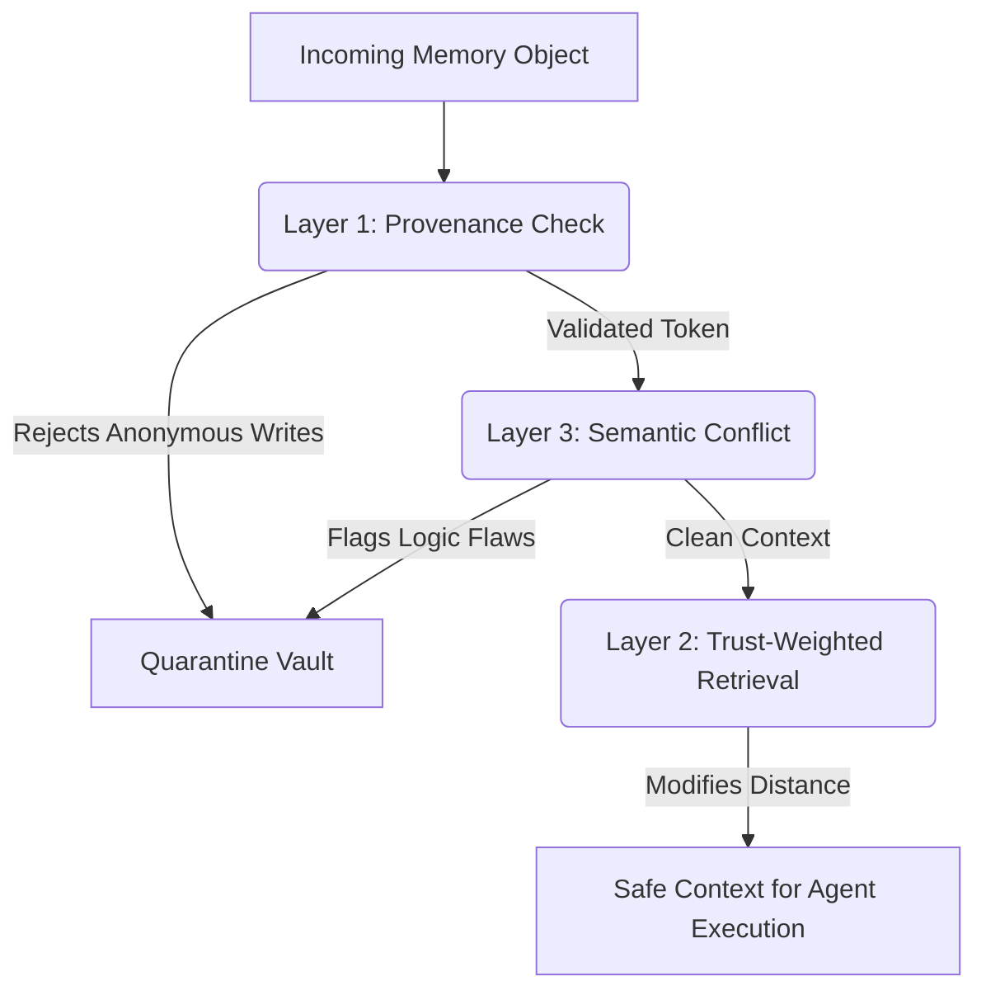

# MemShield Architecture

## Security Pipeline

### 1. Provenance Integrity (Layer 1)
All memory objects MUST possess a cryptographic token (`HMAC-SHA256`). Writes originating from web scrapes or third-party tools receive inherently lower configuration trust scores than direct-user interactions. 

### 2. Trust-Weighted Retrieval & Decay (Layer 2)
Cosine similarity is insufficient. MemShield applies temporal exponential decay to unverified vectors:
`Adjusted_Score = Base_Similarity * Current_Trust(t)`
This prevents dormant exploits from gaining prominence over recent, verified states.

### 3. Semantic Contradiction Detector (Layer 3)
An active LLM node evaluates the incoming trajectory against known historical baselines for structural facts and security policies. If an environmental scrape requests overriding secure routing, it is quarantined.

## Mnemonic Sovereignty
The enterprise retains absolute authority over the vector space. Any flagged object is moved to a read-only isolation vault, permitting forensic rollback via the `Provenance_Token` dependency graph.
